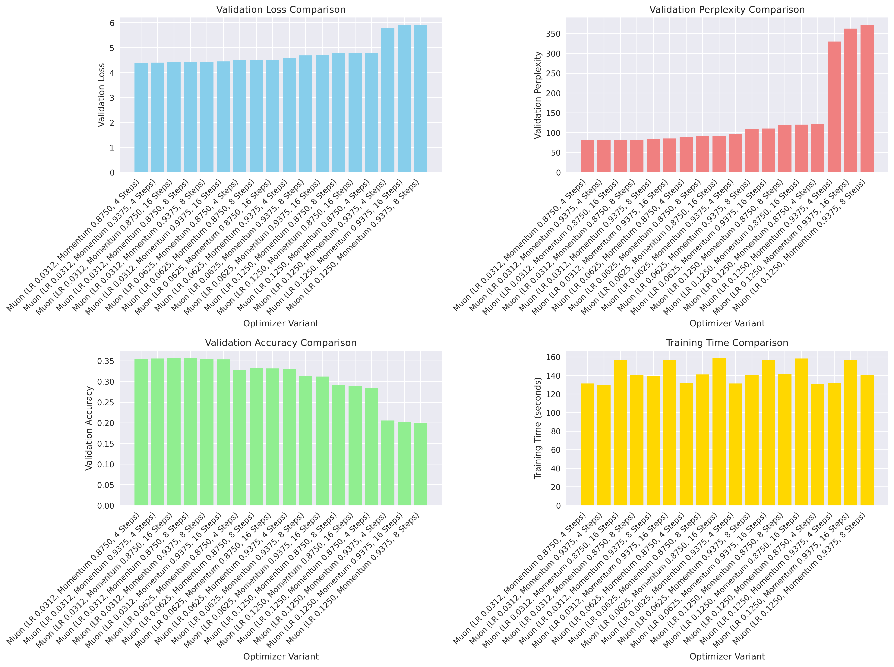
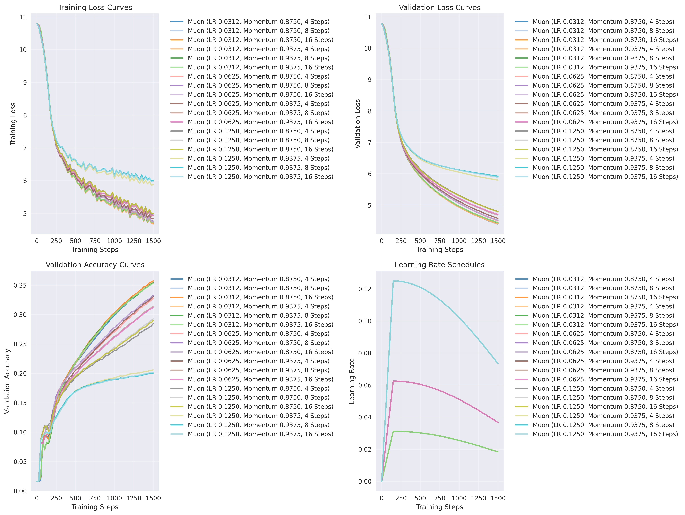
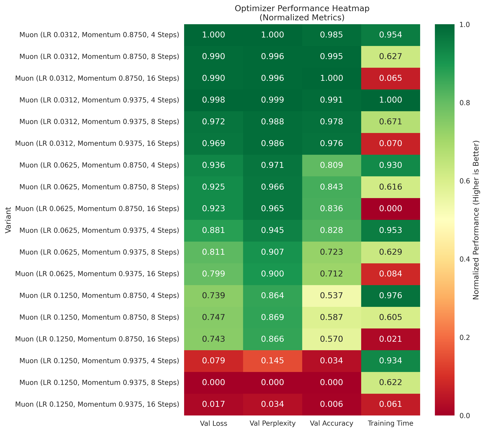

# Muon Optimizer Hyperparameter Ablation Study

A comprehensive ablation study investigating optimal hyperparameter configurations for the Muon optimizer in language modeling tasks. This research systematically evaluates 18 different configurations across learning rate, momentum, and Newton-Schulz iteration parameters.

## 🎯 Key Findings

**Best Configuration**: Muon optimizer with LR 0.0312, Momentum 0.8750, 4 Newton-Schulz steps achieved **validation loss of 4.3998** (81.44 perplexity, 35.5% accuracy) in 131.3 seconds.

**Performance Hierarchy**: Learning rate dominates performance - all top 6 configurations use LR 0.0312, showing 8.9-34.5% improvement over higher learning rates.

**Efficiency Sweet Spot**: 4 Newton-Schulz steps provide optimal computational efficiency, reducing training time by 19.5% compared to 16 steps with equivalent performance.

## 📊 Results Visualization

### Performance Comparison Across All Variants

*Comprehensive comparison showing validation loss, perplexity, accuracy, and training time for all 18 Muon optimizer configurations*

### Training Dynamics and Convergence

*Training loss progression, validation accuracy curves, and learning rate schedules demonstrating convergence patterns across different configurations*

### Hyperparameter Performance Heatmap

*Normalized performance heatmap revealing interaction patterns between learning rate, momentum, and Newton-Schulz steps. Green indicates superior performance, red indicates poor performance.*

## 🏆 Complete Results Ranking

| Rank | Configuration | Val Loss | Val Perplexity | Val Accuracy | Time (s) |
|------|---------------|----------|----------------|--------------|----------|
| 1 | **LR 0.0312, Mom 0.8750, 4 Steps** | **4.3998** | **81.44** | 0.3550 | 131.3 |
| 2 | LR 0.0312, Mom 0.9375, 4 Steps | 4.4031 | 81.70 | **0.3559** | **130.0** |
| 3 | LR 0.0312, Mom 0.8750, 16 Steps | 4.4144 | 82.63 | 0.3573 | 157.1 |
| 4 | LR 0.0312, Mom 0.8750, 8 Steps | 4.4155 | 82.73 | 0.3565 | 140.8 |
| 5 | LR 0.0312, Mom 0.9375, 8 Steps | 4.4430 | 85.03 | 0.3538 | 139.5 |
| 6 | LR 0.0312, Mom 0.9375, 16 Steps | 4.4474 | 85.40 | 0.3535 | 156.9 |
| 7 | LR 0.0625, Mom 0.8750, 4 Steps | 4.4972 | 89.77 | 0.3272 | 132.1 |
| 8 | LR 0.0625, Mom 0.8750, 8 Steps | 4.5145 | 91.33 | 0.3326 | 141.1 |
| 9 | LR 0.0625, Mom 0.8750, 16 Steps | 4.5161 | 91.48 | 0.3316 | 159.0 |
| 10 | LR 0.0625, Mom 0.9375, 4 Steps | 4.5800 | 97.52 | 0.3302 | 131.4 |
| ... | ... | ... | ... | ... | ... |
| 18 | LR 0.1250, Mom 0.9375, 8 Steps | 5.9199 | 372.39 | 0.2004 | 140.9 |

*[See full results table in the research paper]*

## 🔬 Experimental Setup

### Model Architecture
- **Model**: MinimalLLM transformer architecture
- **Dimensions**: 128d model, 2 layers, 4 attention heads
- **Feed-forward**: 512 dimensions (4× model dimension)
- **Sequence Length**: 256 tokens
- **Training Steps**: 1500 with evaluation every 25 steps

### Dataset & Infrastructure
- **Dataset**: HuggingFaceTB/smollm-corpus (cosmopedia-v2 split)
- **Data Size**: 1000 documents (~200K tokens)
- **Batch Size**: 32 samples per gradient update
- **Hardware**: Single NVIDIA RTX 3070 GPU (8GB VRAM) via **Vast.ai**
- **Training Environment**: Cloud GPU rental for cost-effective experimentation

### Hyperparameter Grid
Systematic evaluation across:
- **Learning Rates**: {0.0312, 0.0625, 0.1250} (1/32, 1/16, 1/8)
- **Momentum Values**: {0.8750, 0.9375} (7/8, 15/16)  
- **Newton-Schulz Steps**: {4, 8, 16}
- **Total Configurations**: 3 × 2 × 3 = 18 experiments

## 💡 Key Insights & Recommendations

### 1. Learning Rate is Critical
- **Top Tier (LR 0.0312)**: All 6 best configurations use the lowest learning rate
- **Performance Gap**: Clear threshold effect - even best LR 0.0625 config (4.4972) underperforms worst LR 0.0312 config (4.4474)
- **Stability**: Higher learning rates (0.1250) with high momentum (0.9375) cause severe instability

### 2. Momentum Impact
- **Lower momentum (0.8750)** generally outperforms higher momentum (0.9375)
- **Consistency**: 0.8750 provides stable performance across all learning rate settings
- **Critical at High LR**: Essential for preventing divergence at LR 0.1250

### 3. Newton-Schulz Steps Efficiency
- **4 steps**: Optimal balance of performance and computational cost
- **Diminishing returns**: 8 and 16 steps add 7-20% training time with minimal performance gains
- **Resource optimization**: Use 4 steps unless precision requirements demand more

### 4. Practical Recommendations

**🥇 Primary Recommendation**: `LR 0.0312, Momentum 0.8750, 4 Newton-Schulz Steps`
- Best overall performance (4.3998 validation loss)
- Balanced training time (131.3s)
- Stable convergence characteristics

**⚡ Speed-Optimized**: `LR 0.0312, Momentum 0.9375, 4 Newton-Schulz Steps`
- Fastest training (130.0s)
- Near-optimal performance (4.4031 validation loss)
- Best for resource-constrained scenarios

**🚫 Avoid**: `LR ≥ 0.1250 with Momentum ≥ 0.9375`
- Severe performance degradation (5.8+ validation loss)
- Training instability and poor convergence

## 💰 Cost-Effective Training with Vast.ai

This study demonstrates how **Vast.ai** enables cost-effective deep learning research:

- **Hardware Used**: RTX 3070 (8GB VRAM) at ~$0.20/hour
- **Total Compute Time**: ~43 minutes across 18 experiments
- **Total Cost**: Under $15 for complete ablation study
- **Scalability**: Easy to scale up for larger model experiments

### Vast.ai Setup Tips
1. Filter by RTX 3070+ GPUs for optimal price/performance
2. Use spot instances for non-critical experiments
3. Set up automatic data syncing to avoid losing results
4. Monitor GPU utilization to optimize cost

## 📚 Academic Impact

This work contributes to:
- **Optimizer Research**: Systematic evaluation of Muon optimizer hyperparameters
- **Training Efficiency**: Practical guidelines for computational cost optimization
- **Hyperparameter Studies**: Methodology for structured ablation studies
- **Open Science**: Full reproducibility with code, data, and detailed results

## 🔗 References & Links

- **Muon Optimizer**: [Original Paper](https://kellerjordan.github.io/posts/muon/) by Jordan et al. (2024)
- **Dataset**: [HuggingFaceTB/smollm-corpus](https://huggingface.co/datasets/HuggingFaceTB/smollm-corpus)
- **Infrastructure**: [Vast.ai](https://vast.ai) for affordable GPU compute
- **Research Paper**: See `paper/muon_ablation_paper.tex` for detailed analysis

## 📊 Citation

If you use this work in your research, please cite:

```bibtex
@misc{rosic2024muon_ablation,
  title={Muon Optimizer Hyperparameter Optimization: A Systematic Ablation Study for Language Model Training},
  author={Vuk Rosić and Claude and Gemini},
  year={2024},
  institution={Óbuda University, Anthropic, Google},
  note={Comprehensive ablation study of Muon optimizer configurations}
}
```

## 🤝 Contributing

We welcome contributions to extend this research:
- **Larger Models**: Scale experiments to bigger architectures
- **Extended Training**: Investigate longer training schedules
- **Different Datasets**: Test across diverse text domains
- **Optimizer Comparisons**: Compare with AdamW, SGD, Lion optimizers
- **Dynamic Scheduling**: Implement adaptive hyperparameter strategies

## 📝 License

MIT License - feel free to use this code and methodology for your own research.

---

**Authors**: Vuk Rosić (Óbuda University), Claude (Anthropic), Gemini (Google)  
**Contact**: vukrosic1@gmail.com  
**Last Updated**: July 2024