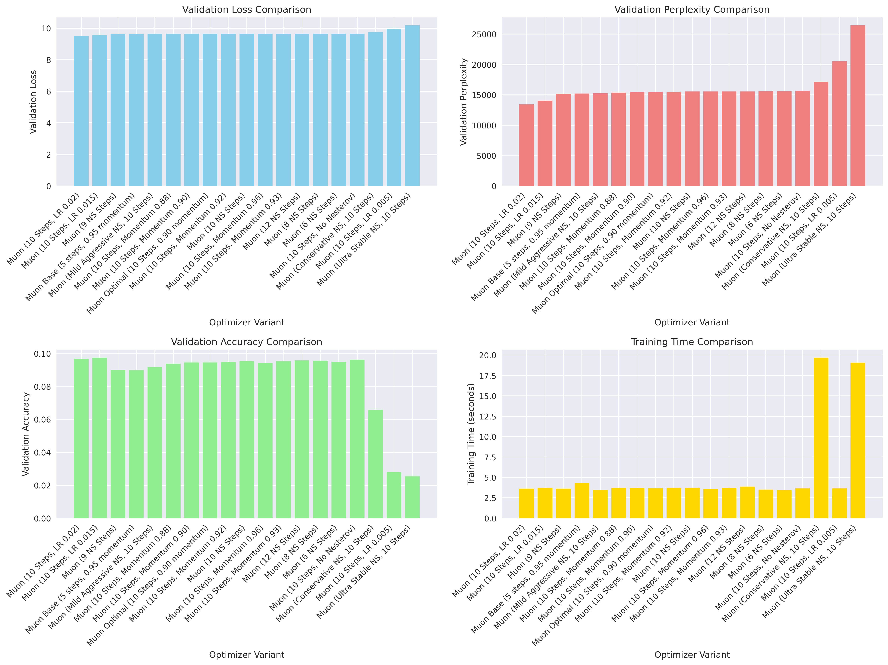
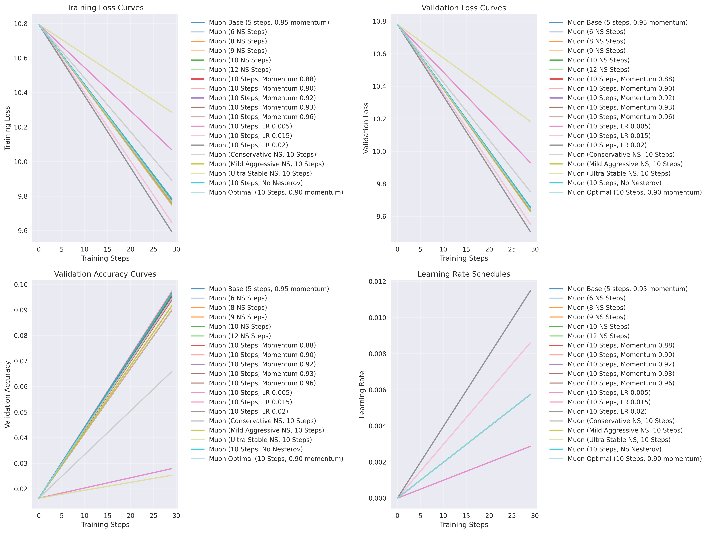
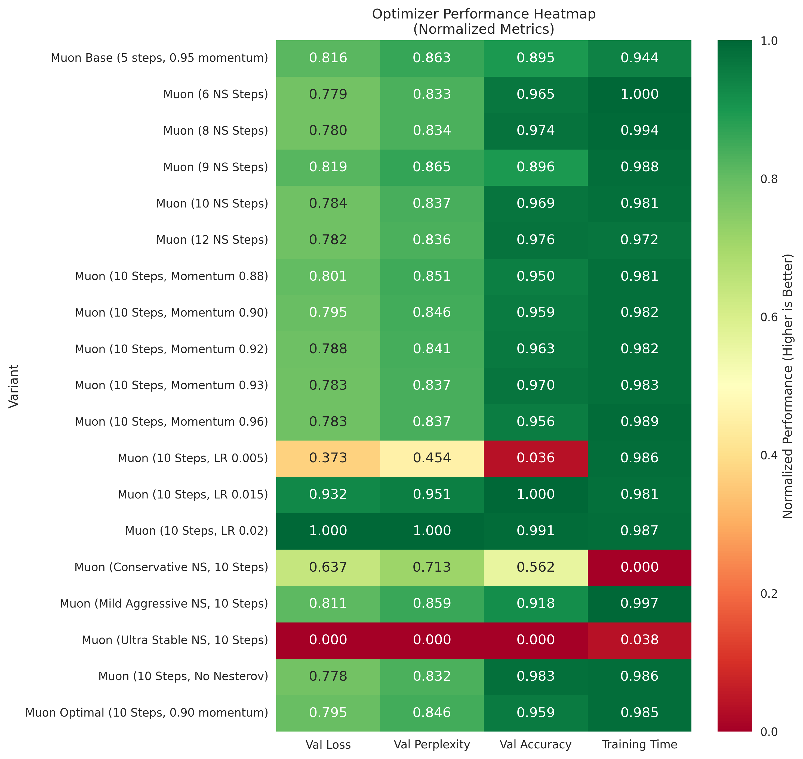

# Muon Optimizer Ablation Study

This README summarizes the results of a focused ablation study on the Muon optimizer, exploring the impact of various hyperparameters on model performance.

## Learn More About Muon

*   [Introduction to Muon Optimizer](tutorials/introduction_to_muon.md)
*   [Muon Optimizer Hyperparameters Explained](tutorials/muon_hyperparameters.md)
*   [Interpreting Ablation Studies and Key Metrics](tutorials/interpreting_ablation_studies.md)

## Visualizations

### Performance Comparison

This plot visually compares the key performance metrics (Validation Loss, Validation Perplexity, Validation Accuracy, and Training Time) across all the different Muon optimizer variants tested in this study. It allows for a quick overview of which configurations performed best or worst on each metric. Lower values are better for Loss, Perplexity, and Time, while higher values are better for Accuracy.

### Training Curves

The training curves illustrate the progression of validation loss (and potentially training loss) over the course of training steps for each optimizer variant. These plots are crucial for understanding convergence behavior, identifying potential overfitting (where validation loss starts to increase while training loss continues to decrease), and assessing the stability of the training process for different Muon configurations.

### Performance Heatmap

This heatmap provides a visual representation of how combinations of two key hyperparameters (e.g., Learning Rate and Momentum, or NS Steps and Momentum) affect a specific performance metric, typically validation loss. Darker or lighter shades indicate better or worse performance, helping to identify optimal regions or interactions between hyperparameters.

## Experiment Configuration

*   **Model Architecture:** 256d, 4L, 8H
*   **Training Steps:** 30
*   **Batch Size:** 32
*   **Sequence Length:** 256
*   **Base Learning Rate:** 0.01
*   **Evaluation Frequency:** Every 50 steps
*   **Total Experiments:** 19 (19 successful)

## Best Performing Optimizer

**Muon (10 Steps, LR 0.02)**
*   **Validation Loss:** 9.5052
*   **Validation Perplexity:** 13428.71
*   **Validation Accuracy:** 0.0969
*   **Training Time:** 3.6s

## Detailed Results

| Rank | Optimizer Variant                 | Val Loss | Val Perplexity | Val Accuracy | Training Time (s) | Improvement vs Base |
|------|-----------------------------------|----------|----------------|--------------|-------------------|---------------------|
| 1    | Muon (10 Steps, LR 0.02)          | 9.5052   | 13428.71       | 0.0969       | 3.6               | +1.3%               |
| 2    | Muon (10 Steps, LR 0.015)         | 9.5513   | 14062.72       | 0.0975       | 3.7               | +0.8%               |
| 3    | Muon (9 NS Steps)                 | 9.6282   | 15187.65       | 0.0900       | 3.6               | +0.0%               |
| 4    | Muon Base (5 steps, 0.95 momentum)| 9.6302   | 15217.08       | 0.0899       | 4.3               |                     |
| 5    | Muon (Mild Aggressive NS, 10 Steps)| 9.6335   | 15267.47       | 0.0916       | 3.5               | -0.0%               |
| 6    | Muon (10 Steps, Momentum 0.88)    | 9.6401   | 15368.40       | 0.0939       | 3.7               | -0.1%               |
| 7    | Muon (10 Steps, Momentum 0.90)    | 9.6441   | 15429.92       | 0.0945       | 3.7               | -0.1%               |
| 8    | Muon Optimal (10 Steps, 0.90 momentum)| 9.6441   | 15429.92       | 0.0945       | 3.7               | -0.1%               |
| 9    | Muon (10 Steps, Momentum 0.92)    | 9.6488   | 15503.22       | 0.0948       | 3.7               | -0.2%               |
| 10   | Muon (10 NS Steps)                | 9.6518   | 15549.74       | 0.0953       | 3.7               | -0.2%               |
| 11   | Muon (10 Steps, Momentum 0.96)    | 9.6522   | 15556.71       | 0.0943       | 3.6               | -0.2%               |
| 12   | Muon (10 Steps, Momentum 0.93)    | 9.6523   | 15557.11       | 0.0954       | 3.7               | -0.2%               |
| 13   | Muon (12 NS Steps)                | 9.6531   | 15570.55       | 0.0958       | 3.9               | -0.2%               |
| 14   | Muon (8 NS Steps)                 | 9.6543   | 15588.78       | 0.0956       | 3.5               | -0.3%               |
| 15   | Muon (6 NS Steps)                 | 9.6550   | 15599.34       | 0.0950       | 3.4               | -0.3%               |
| 16   | Muon (10 Steps, No Nesterov)      | 9.6558   | 15612.40       | 0.0962       | 3.6               | -0.3%               |
| 17   | Muon (Conservative NS, 10 Steps)  | 9.7512   | 17174.95       | 0.0659       | 19.7              | -1.3%               |
| 18   | Muon (10 Steps, LR 0.005)         | 9.9301   | 20539.65       | 0.0279       | 3.6               | -3.1%               |
| 19   | Muon (Ultra Stable NS, 10 Steps)  | 10.1834  | 26459.56       | 0.0253       | 19.1              | -5.7%               |

## Key Insights

*   **Overall Best:** Muon (10 Steps, LR 0.02) achieved the lowest validation loss of 9.5052.
*   **Speed Champion:** Muon (6 NS Steps) completed training in 3.4 seconds.
*   **Performance Range:** Validation loss ranged from 9.5052 to 10.1834.
*   **Newton-Schulz Steps:** The best performing variant in terms of Newton-Schulz steps was Muon (10 Steps, LR 0.02) with 9.5052 validation loss.
*   **Momentum Analysis:** The best momentum variant was Muon (10 Steps, Momentum 0.88) with 9.6401 validation loss.
*   **Best Improvement:** Muon (10 Steps, LR 0.02) improved upon the base Muon by 1.3%.

**Generated on:** 2025-07-23 18:02:17
**Total Training Time:** 101.5 seconds
**Success Rate:** 19/19 experiments (100.0%)